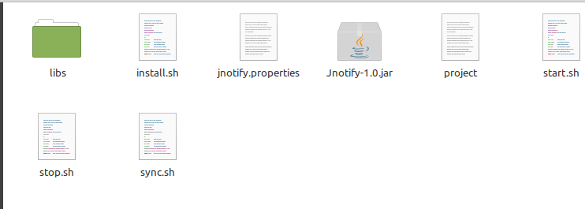

# Jnotify

最近一直在致力于搭建个人的文档笔记系统。最后选中了`typora`,`typora`本身是一个优秀的markdown工具，同时支持三平台的书写。但是不支持云端同步，为了解决这个问题，我写出了`jnotify`


> `Jnotify`一个基于`git`的文档同步系统

## 优点

1. `jnotify` 基于git技术，将文档自动同步到云端，同时提供手动从云端同步功能。
2. `jnotify`选用`java`作为开发语言，方便修改
3. 免费

## 缺点

1. 不支持大文件，视频，大的压缩包，所以目前场景定位在文档同步
2. 文档的安全性基于远端的私仓


## 安装方式

> 目前在linux 环境测试通过

1. 下载发布包，解压

   

其中`jnotify.properties`描述了，项目云端的配置，包括云端同步地址，用户名密码

,仓库在本地的存储地址等等.

`project`配置了需要同步到云端的地址,书写格式为<span style="color:#f50"> 存储地址</span>，<span style="color:#f50">待同步文档地址</span>

```sh
~/.jnotify/pkg/workmd,/home/lame/workmd
```

配置文件修改完成后，执行install.sh,程序安装完成，执行start.sh 开始运行